# Procedures

## Step 1: Deploy Core Network

Choose one of the following deployment options:

### Option A (Automatic - Recommended):

1. Click the **One-Click Deploy** button on the top toolbar.
2. Confirm the deployment when prompted.
3. **Observation:** The system will automatically clear any existing topology and sequentially deploy the Service Bus, then all Network Functions (NRF, AMF, SMF, UPF, AUSF, UDM, PCF, NSSF, UDR, MySQL, gNB, UE, ext-dn), and establish the necessary connections. NFs will appear one by one.

### Option B (Manual):

Manually add each Network Function from the Network Function panel, then enter configuration details in the left configuration panel and start the NF.

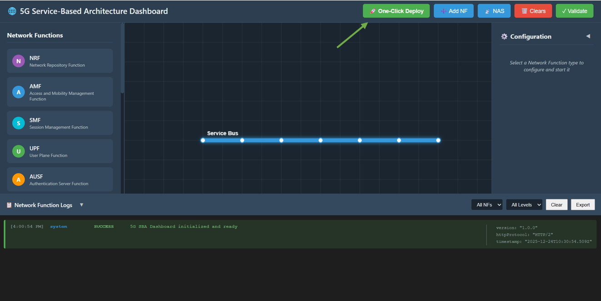

**Fig: Core Network Deployment**

---

## Step 2: Enable NAS Registration Mode

Once the core network is successfully deployed (wait for the "One-Click Topology Deployed!" alert):

1. Click on the **NAS** button in the top toolbar to switch the interface to the NAS Registration experiment mode.

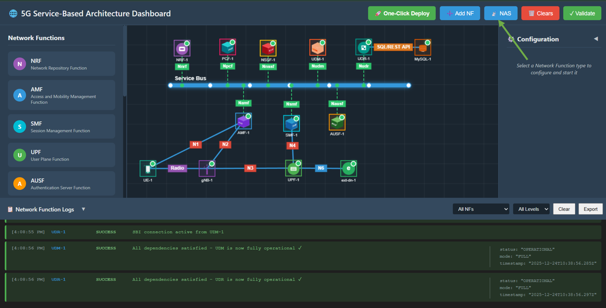

**Fig: Enable NAS Registration Mode**

---

## Step 3: Observe Experiment Panels

You will now see the interface transform:

- **Right Panel (NAS Registration Process):** A list of 13 interactive steps representing the registration flow.
- **Left Panel (NAS Messages):** An inspector panel that displays the JSON content of every NAS message sent between NFs.

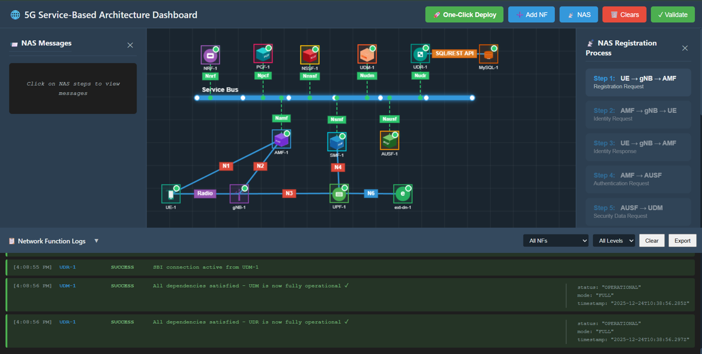

**Fig: Experiment Panels Overview**

---

## Step 4: Perform Registration Procedure

Follow the steps in the right panel sequentially. Click each step button to execute the action.

### Step 1: Registration Request

**Action:** Click **Step 1: UE → gNB → AMF** in the right panel.

**Description:** UE sends a Registration Request to the AMF via the gNB.

**Observation:** A packet travels from UE to gNB, then to AMF. The left panel displays the JSON message containing the `RegistrationRequest` with `SUCI` (Subscription Concealed Identifier).

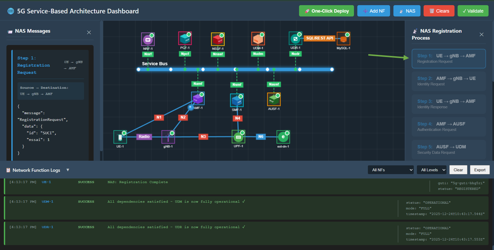

**Fig: Step 1: Registration Request**

---

### Step 2: Identity Request

**Action:** Click **Step 2: AMF → gNB → UE**.

**Description:** AMF requests the UE's identity.

**Observation:** A packet travels from AMF to gNB, then to UE. The JSON message shows `IdentityRequest`.

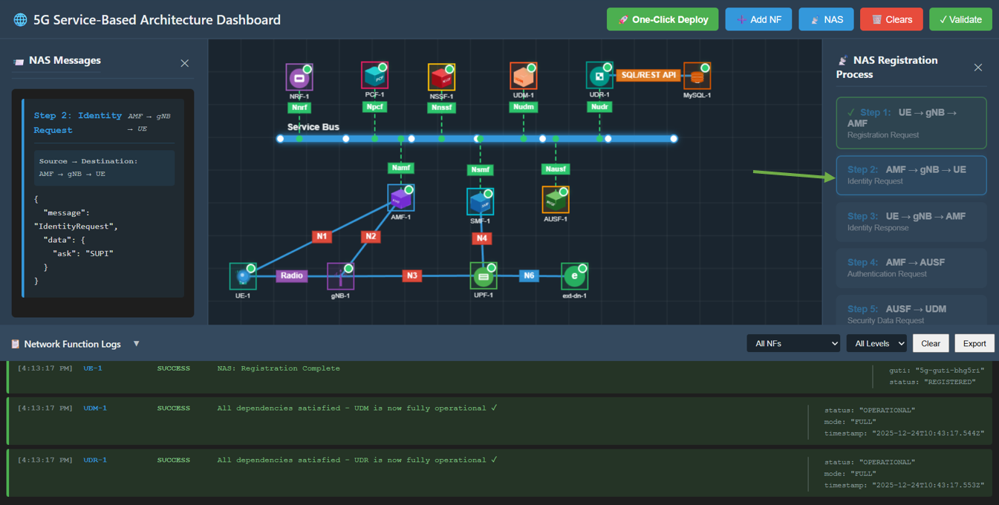

**Fig: Step 2: Identity Request**

---

### Step 3: Identity Response

**Action:** Click **Step 3: UE → gNB → AMF**.

**Description:** UE responds with its identity (SUPI/IMSI).

**Observation:** A packet travels from UE back to AMF. The JSON message contains the `IdentityResponse` with `supi`.

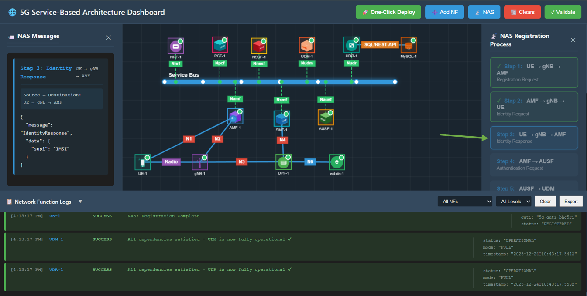

**Fig: Step 3: Identity Response**

---

### Step 4: Authentication Request

**Action:** Click **Step 4: AMF → AUSF**.

**Description:** AMF initiates authentication with the AUSF (Authentication Server Function).

**Observation:** A packet travels from AMF to AUSF. The JSON message shows `AuthenticationRequest` using `5G-AKA`.

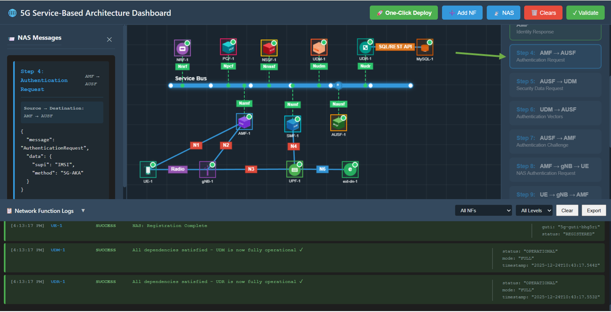

**Fig: Step 4: Authentication Request**

---

### Step 5: Security Data Request

**Action:** Click **Step 5: AUSF → UDM**.

**Description:** AUSF requests security data from the UDM (Unified Data Management).

**Observation:** A packet travels from AUSF to UDM.

**Fig: Step 5: Security Data Request**

---

### Step 6: Authentication Vectors

**Action:** Click **Step 6: UDM → AUSF**.

**Description:** UDM generates and sends authentication vectors to AUSF.

**Observation:** Packet travels from UDM to AUSF. Message contains `AuthenticationVectors` (RAND, AUTN).

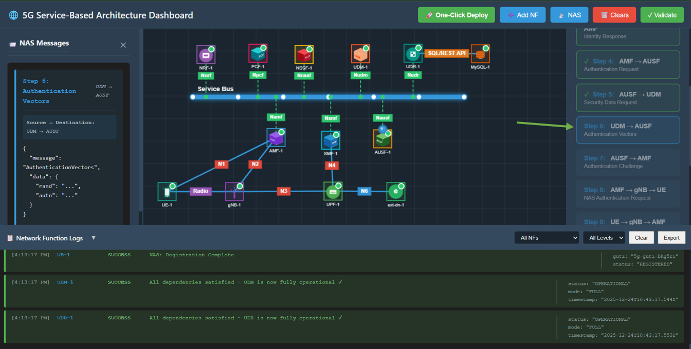

**Fig: Step 6: Authentication Vectors**

---

### Step 7: Authentication Challenge

**Action:** Click **Step 7: AUSF → AMF**.

**Description:** AUSF forwards the authentication challenge to the AMF.

**Observation:** Packet travels from AUSF to AMF.

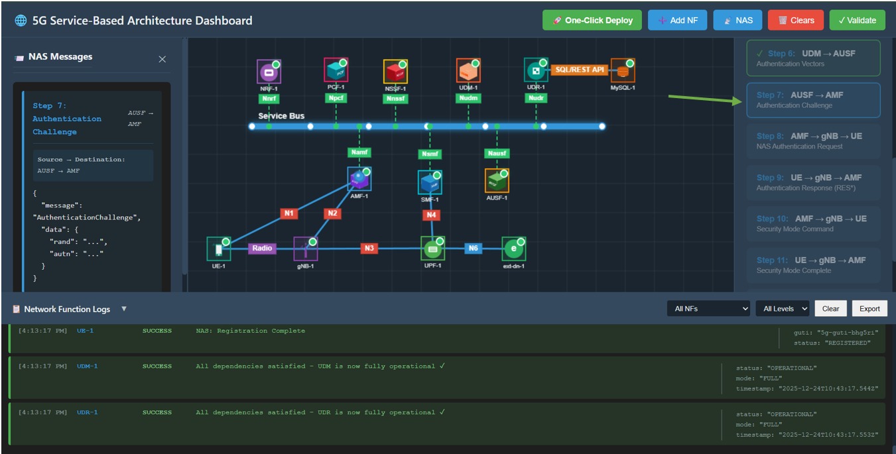

**Fig: Step 7: Authentication Challenge**

---

### Step 8: NAS Authentication Request

**Action:** Click **Step 8: AMF → gNB → UE**.

**Description:** AMF challenges the UE to authenticate itself.

**Observation:** Packet travels from AMF to UE. Message is `NASAuthenticationRequest`.

**Fig: Step 8: NAS Authentication Request**

---

### Step 9: Authentication Response

**Action:** Click **Step 9: UE → gNB → AMF**.

**Description:** UE computes the response (RES*) and sends it back to AMF.

**Observation:** Packet travels from UE to AMF. Message contains `AuthenticationResponse`.

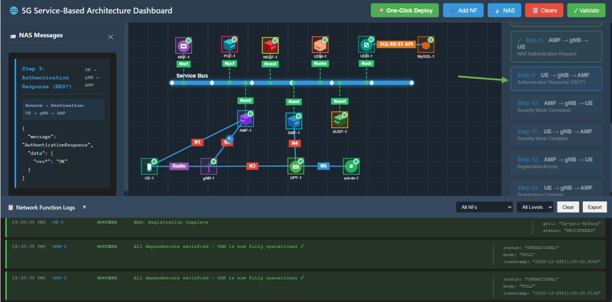

**Fig: Step 9: Authentication Response**

---

### Step 10: Security Mode Command

**Action:** Click **Step 10: AMF → gNB → UE**.

**Description:** AMF creates a secure context and commands the UE to enable security.

**Observation:** Packet travels from AMF to UE. Message contains `SecurityModeCommand` (ciphering/integrity algorithms).

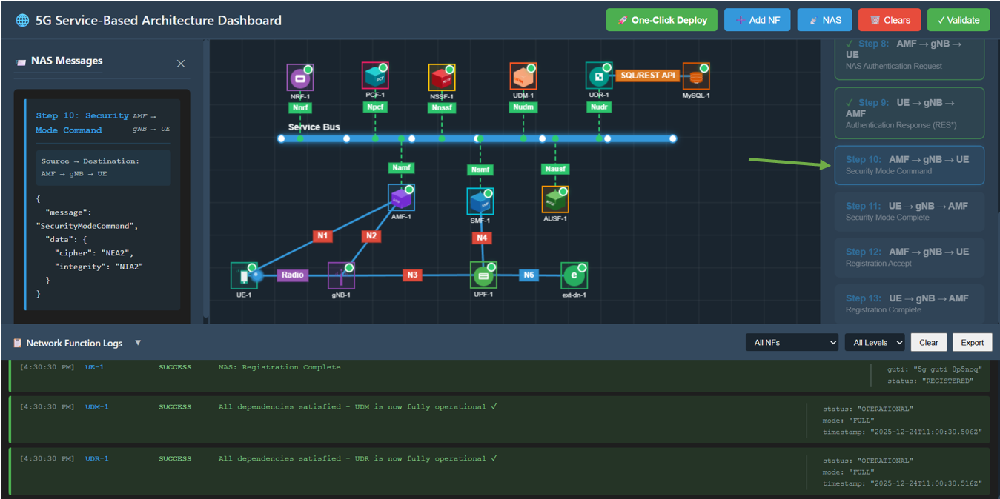

**Fig: Step 10: Security Mode Command**

---

### Step 11: Security Mode Complete

**Action:** Click **Step 11: UE → gNB → AMF**.

**Description:** UE confirms security is active.

**Observation:** Packet travels to AMF. Message is `SecurityModeComplete`.

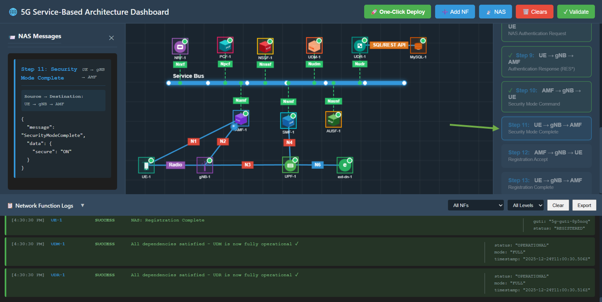

**Fig: Step 11: Security Mode Complete**

---

### Step 12: Registration Accept

**Action:** Click **Step 12: AMF → gNB → UE**.

**Description:** AMF accepts the registration and assigns a temporary ID (5G-GUTI).

**Observation:** Packet travels to UE. Message is `RegistrationAccept` containing `5G-GUTI`.

**Fig: Step 12: Registration Accept**

---

### Step 13: Registration Complete

**Action:** Click **Step 13: UE → gNB → AMF**.

**Description:** UE acknowledges the registration is complete.

**Observation:** Packet travels to AMF. Message is `RegistrationComplete` with status `OK`.

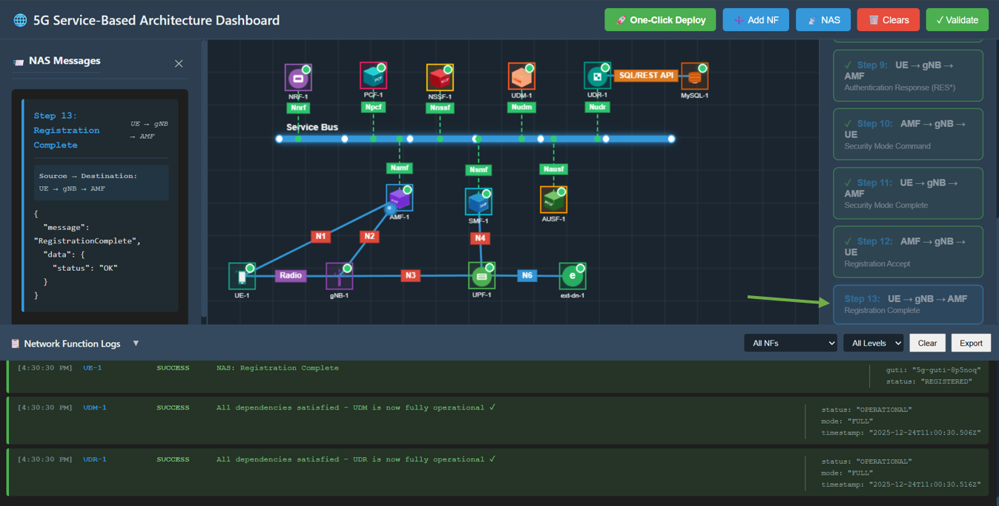

**Fig: Step 13: Registration Complete**
