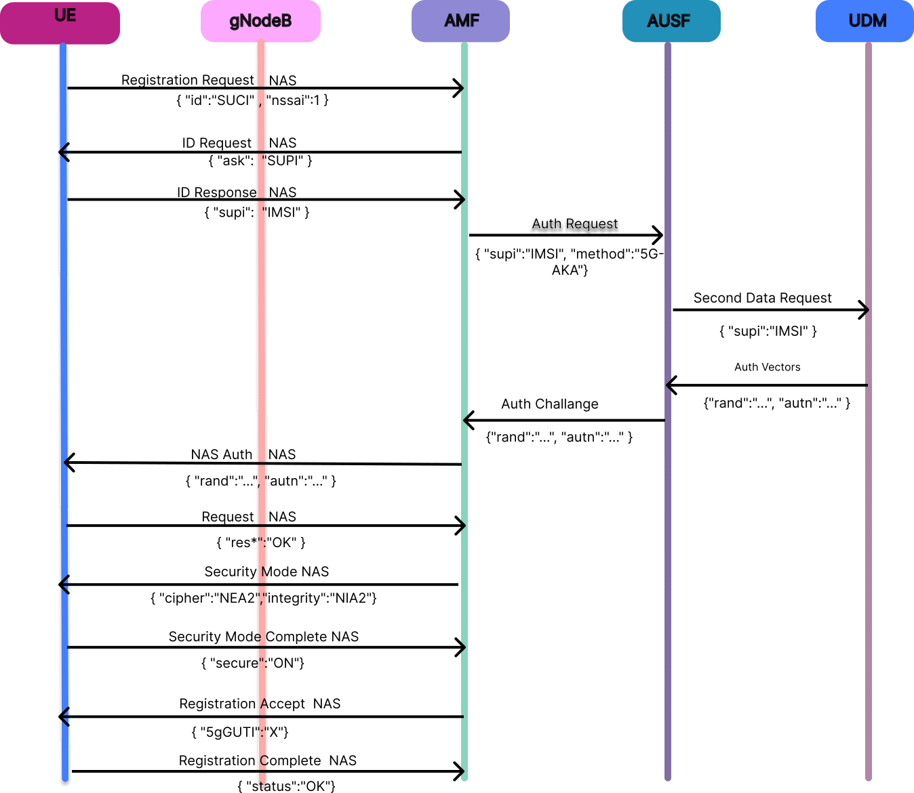

## 1. Introduction

Registration Management is one of the most fundamental procedures in 5G Standalone (SA) networks, serving as the gateway through which User Equipment gains authorized access to network services. This experiment provides comprehensive hands-on experience with both Initial Registration and Mobility Registration Update procedures, demonstrating how 5G networks manage user identity, authentication, security, and mobility.

The registration procedure represents a sophisticated orchestration of signaling between multiple network functions. When a UE attempts to access the 5G network, it initiates a complex dialogue involving identity verification, mutual authentication, security establishment, and policy application. This process ensures that only authorized subscribers can access network resources while maintaining privacy and security throughout.

### 1.1 Background and Theoretical Concepts:

In 5G networks, Registration Management has evolved significantly from its 4G predecessor to support the Service-Based Architecture (SBA) paradigm. The procedure now handles network slicing, enhanced privacy protection through Subscription Concealed Identifier (SUCI), and more granular mobility management through Registration Areas.

Initial Registration occurs when a UE connects to the 5G network for the first time or after being deregistered. During this procedure, the UE must prove its identity, authenticate with the core network, establish security contexts, and receive authorization for specific network slices and services.

Mobility Registration Update is triggered when a UE moves across Tracking Areas (TA) that are outside its current Registration Area. This procedure allows the network to maintain an updated location of the UE without requiring full re-authentication, thereby reducing signaling overhead and improving mobility efficiency.

The registration process relies on two distinct signaling layers:

* **RAS (Radio Access Stratum):** Signaling between UE and gNB using RRC protocol for radio resource management
* **NAS (Non-Access Stratum):** Signaling between UE and AMF that is transparent to the gNB, handling mobility, session, and authentication procedures

### 1.2 The Role of AMF in Registration Management:

The Access and Mobility Management Function (AMF) serves as the central control point for all registration procedures. It performs several critical functions:

* Terminates all NAS signaling from the UE
* Coordinates authentication through AUSF
* Retrieves subscriber data from UDM
* Applies access and mobility policies from PCF
* Manages Registration Areas and Tracking Area Lists
* Allocates temporary identities (5G-GUTI) for privacy protection
* Handles mobility between different registration areas

## 2. Fundamentals

### 2.1 5G Core Network Functions Involved

The registration procedure involves coordination among multiple network functions, each playing a specific role:

| Network Function | Full Name | Role in Registration |
|---|---|---|
| UE | User Equipment | Initiates registration, proves identity, responds to authentication challenges |
| gNB | Next Generation NodeB | Provides radio access, forwards NAS messages between UE and AMF |
| AMF | Access and Mobility Management Function | Orchestrates registration, manages mobility, terminates NAS signaling |
| AUSF | Authentication Server Function | Performs subscriber authentication, validates credentials |
| UDM | Unified Data Management | Stores subscription data, generates authentication vectors |
| UDR | Unified Data Repository | Database backend for subscriber information |
| PCF | Policy Control Function | Provides access and mobility policies |
| NRF | Network Repository Function | Service discovery for network functions |

## 3. UE Registration Process: Detailed Flow

The comprehensive signaling flow for a 5G User Equipment (UE) registration is a sophisticated, multi-phase procedure. As illustrated in **Figure 1**, this process highlights the chronological sequence of interactions among the UE, the Next Generation NodeB (gNB), and essential 5G Core Network functions (such as the AMF, AUSF, and UDM). 

<div align="center">
  
  <br>
  <em>Figure 1: UE Registration Overall Message Flow</em>
</div>

The end-to-end process depicted above encompasses the initial radio access establishment, core network admission, mutual authentication, security context activation, and the final registration approval. Together, these phases ensure a secure and authorized connection to the 5G network, establishing the foundation for subsequent data services.

### 3.1 Phase 1: Radio Access Establishment:

**Step 1 – UE Power-On and Cell Synchronization**

Upon power-on, the UE must synchronize to the 5G radio environment to initiate communication.

**Interface: NR-Uu**

**UE Receives:**
* Synchronization Signal Blocks (SSB)
* System Information Blocks (SIB1)
* PLMN ID
* Tracking Area Code
* gNB broadcast cell parameters
* RACH configuration parameters

**UE Sends:** 
Nothing yet, only performs decoding.

This step ensures that the UE identifies a valid 5G cell and acquires necessary system configuration.

**Step 2 – Random Access Channel (RACH) Procedure**

RACH provides a contention-based mechanism for initial uplink access. It assigns temporary identifiers and uplink timing.

**Interface: NR-Uu**

**UE Sends:**
* Random Access Preamble (Contains: Preamble ID, UE temporary randomness)

**gNB Sends Back:**
* Random Access Response (RAR)
  * Timing Advance
  * Temporary C-RNTI
  * UL Resource Grant

**Outcome:**
The UE now has uplink timing coordination and an RRC path initiation capability.

### 3.2 Phase 2: RRC Connection Establishment

**Step 3 – RRC Connection Setup**

RRC is required to carry NAS signaling. This phase builds the essential control-plane bearer.

**Interface: NR-Uu**

**UE Sends:**
* RRC Setup Request
  * RRC Establishment Cause (e.g., "Mobile Originating Signaling")

**gNB Sends:**
* RRC Setup
  * Radio bearer configuration
  * RRC parameters

This provides UE a dedicated signaling channel.

**Step 4 – RRC Setup Complete + NAS Registration Request**

Now NAS signaling begins. UE submits identification, capabilities, and intent to register.

**Interfaces:**
* NR-Uu (radio layer)
* N1 logical UE →  AMF carried over the N2 interface

**UE Sends:**
* RRC Setup Complete containing: NAS Registration Request message

**NAS Registration Request includes:**
* UE Identity
  * SUCI (Subscription Concealed Identifier; encrypted SUPI)
* Registration Type:
  * Initial Registration
* Last Known Tracking Area Identity
* Requested NSSAI (Network Slice list)
* UE Security Capability
* PDU Session Status (optional)

Note: UE still does not have an IP address. All communication is signaling based.

### 3.3 Phase 3: Core Network Admission Handling

**Step 5 – Forwarding Registration to AMF**

The gNB cannot process NAS. It forwards data to AMF using NGAP signaling.

**Interface: N2**

gNB (192.168.1.20) → AMF (192.168.1.10)

**gNB Sends:**
* Initial UE Message
  * RAN UE NGAP ID
  * NAS Registration Request (as received)
  * UE Location (Cell ID, TAI)
  * Access Cause

AMF now becomes the brain controlling UE registration.

**Step 6 – UE Identity Confirmation**

If SUCI or valid identity unavailable, AMF requests explicit identity.

**Interfaces: N1 via N2**

**AMF Sends to UE:**
* NAS Identity Request
  * Requests: SUPI (IMSI) or 5G-GUTI or IMEI (if equipment validation needed)

**UE Sends:**
* NAS Identity Response
  * SUPI (Permanent Subscriber Identity)

At this moment, AMF securely recognizes subscriber identity.

### 3.4 Phase 4: Authentication & Security

**Step 7 – Authentication Vector Acquisition**

Authentication validates subscriber identity through AUSF and UDM using 5G AKA.

**Interfaces & IP Path:**
* AMF (192.168.1.10)
* AUSF (192.168.1.30)
* UDM (192.168.1.40)

**AMF Sends to AUSF:**
* Authentication Request
  * SUPI
  * Authentication Method = 5G AKA

**AUSF Communicates with UDM:**
* Requests Authentication Vectors

**UDM Returns to AUSF:**
* RAND (Random Challenge)
* AUTN (Authentication Token)
* XRES*
* K_SEAF (Security Anchor Key)

**AUSF Sends to AMF:**
* Authentication Response including above vectors

**Step 8 – NAS Authentication with UE**

Mutual authentication ensures both UE and network trust each other.

**AMF Sends to UE:**
* NAS Authentication Request
  * RAND
  * AUTN

**UE Actions:**
* Validates AUTN → confirms network authenticity
* Computes Response RES*

**UE Sends:**
* NAS Authentication Response
  * RES*

AMF compares RES with XRES*

If matched → UE authenticated successfully.

**Step 9 – Security Mode Command**

Security context activation ensures encryption and integrity protection.

**AMF Sends:**
* NAS Security Mode Command
  * Selected Ciphering Algorithm (e.g., 128-NEA2)
  * Selected Integrity Algorithm (e.g., 128-NIA2)

**UE Sends:**
* Security Mode Complete

From this point onward:
* All NAS signaling is encrypted
* Integrity Protected
* Secure communication is guaranteed

### 3.5 Phase 5: Subscription, Policy & Context Establishment

**Step 10 – UE Context Registration & Subscription Retrieval**

AMF must register UE in network database and retrieve service entitlements.

**Interfaces:**
* Nudm (AMF ↔ UDM)
* Npcf (AMF ↔ PCF)

**AMF Sends:**
* UECM Registration
* Subscription Data Request

**UDM Returns:**
* Allowed NSSAI
* Subscription Profile
* Access Restrictions
* Mobility Policies

**AMF Requests Policy from PCF**

**PCF Returns:**
* Access/Mobility Policies
* QoS Policy Rules
* Charging Constraints

This ensures user receives only authorized services.

### 3.6 Phase 6: Registration Completion

**Step 11 – Registration Acceptance**

Network now approves the user and assigns operational identity.

**AMF Sends to UE (via gNB):**
* NAS Registration Accept
  * 5G-GUTI (Temporary Identity)
  * Allowed NSSAI
  * TAI List (allowed mobility region)
  * Timer Values (e.g., periodic registration)

**Step 12 – Radio Reconfiguration**

gNB applies any updated configuration.

**gNB Sends:**
* RRC Reconfiguration

**UE Responds:**
* RRC Reconfiguration Complete

**Step 13 – Final UE Acknowledgment**

This confirms successful attachment.

**UE Sends:**
* NAS Registration Complete

**UE is now:**
* Registered, Authenticated, Secure, Policy-Enabled and Ready for Data Services

## 4. Registration Types in 5G

The 3GPP specification (TS 24.501) defines several registration types, each serving different purposes:

### 4.1 Initial Registration:

Initial Registration is performed when the UE does not have any valid registration context with the network.

**Trigger Conditions:**
* UE is powered on for the first time
* UE enters a new Public Land Mobile Network (PLMN)
* UE does not possess a valid 5G-GUTI
* UE was previously deregistered

**Network Behavior:**
* Full authentication is mandatory
* Fresh security keys are generated
* New UE context is created in AMF and UDM
* UE is assigned a new 5G-GUTI
* Complete subscription data is retrieved

**JSON Representation:**
```json
{
  "registrationType": "INITIAL",
  "description": "First-time registration to the network"
}
```

### 4.2 Mobility Registration Update:

Mobility Registration Update is triggered when the UE moves across Tracking Area boundaries.

**Trigger Conditions:**
* UE enters a Tracking Area Identity (TAI) not in its current Registration Area
* UE changes serving AMF (AMF relocation)
* UE moves between different Radio Access Technologies

**Network Behavior:**
* Authentication may be skipped if security context remains valid
* UE location is updated in AMF and UDM
* Paging area is recalculated
* Registration Area may be updated
* Signaling overhead is minimized

**JSON Representation:**
```json
{
  "registrationType": "MOBILITY",
  "description": "Registration update due to UE movement across TA boundary"
}
```

### 4.3 Periodic Registration Update

Periodic registration serves as a keep-alive mechanism:
* Triggered by expiry of T3512 timer (typically 54 minutes)
* Confirms UE is still reachable
* Prevents stale UE contexts
* No location update or slice modification

## 5. Initial Registration Call Flow

The following table details each message in the Initial Registration procedure:

| Step | Message | Direction | Purpose | Key Parameters |
|---|---|---|---|---|
| 1 | RRCSetupComplete + Registration Request | UE → gNB → AMF | Initiate registration | SUCI, Requested NSSAI, Registration Type |
| 2 | Identity Request | AMF → gNB → UE | Request permanent identity | Identity Type (SUPI) |
| 3 | Identity Response | UE → gNB → AMF | Provide permanent identity | SUPI (IMSI) |
| 4 | Authentication Request | AMF → AUSF | Initiate authentication | SUPI, serving network name |
| 5 | Sec Data Request | AUSF → UDM | Fetch authentication vectors | SUPI |
| 6 | Authentication Vectors | UDM → AUSF | Provide auth data | RAND, AUTN, XRES* |
| 7 | Authentication Challenge | AUSF → AMF | Return challenge | RAND, AUTN |
| 8 | NAS Authentication Request | AMF → gNB → UE | Challenge subscriber | RAND, AUTN |
| 9 | NAS Authentication Response | UE → gNB → AMF | Prove identity | RES* |
| 10 | Security Mode Command | AMF → gNB → UE | Establish security | NAS encryption, NAS integrity algorithms |
| 11 | Security Mode Complete | UE → gNB → AMF | Confirm security setup | Protected with security |
| 12 | Registration Accept | AMF → gNB → UE | Grant registration | 5G-GUTI, Allowed NSSAI, TAI List |
| 13 | Registration Complete | UE → gNB → AMF | Acknowledge success | Confirmation |

## 6. Mobility Registration Update Flow

When a UE moves to a new Tracking Area outside its Registration Area:

**Trigger:**
* UE detects new TAI from system information
* New TAI not present in UE's stored TAI List
* UE initiates Mobility Registration Update

**Simplified Flow:**

```
UE → gNB → AMF: Mobility Registration Request
  {registrationType: "MOBILITY", 5G-GUTI, lastVisitedTAI}
  
AMF: Verify UE context and security
  - If security context valid → skip authentication
  - Update UE location in UDM
  
AMF → UE: Registration Accept
  {Updated TAI List, same or new 5G-GUTI}
  
UE → AMF: Registration Complete
```

**Key Differences from Initial Registration:**
* Authentication may be bypassed if security context is fresh
* No subscription data retrieval needed
* Faster procedure due to existing context
* Primarily updates location information
